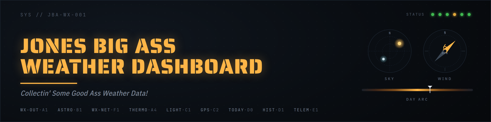
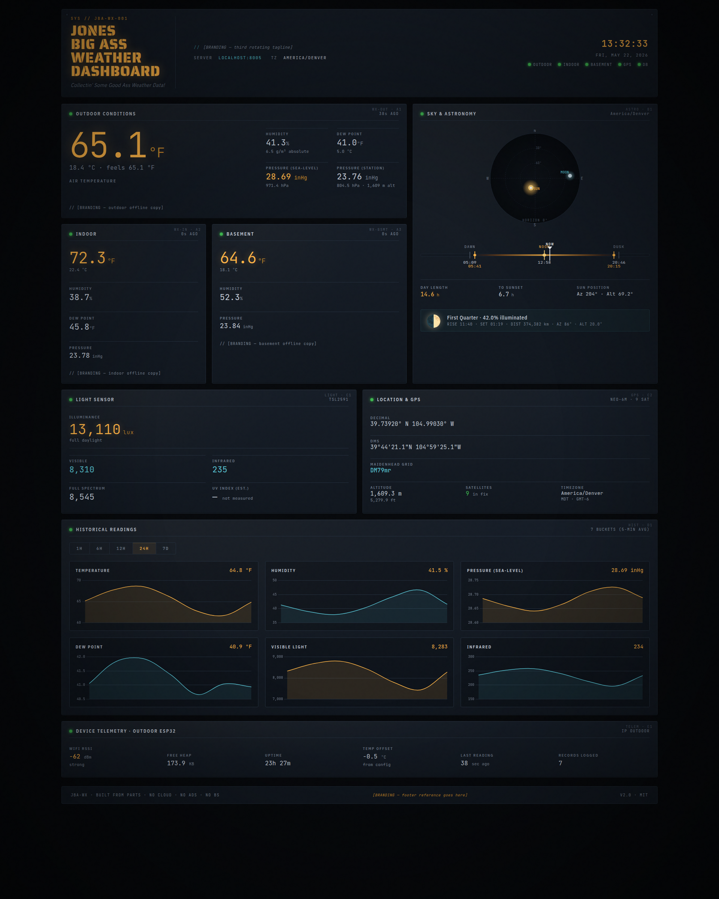

<p align="center">
  
</p>

# Jones' Big Ass Home Weather Station™ Dashboard

**Hey friends!**  
Tired of stickin’ your head out the damn window like a fool every time you wanna know if it’s gonna rain?  
Well come on down to **Jones’ Big Ass Home Weather Station™** — the cheapest, drunkest, most motivated DIY networked weather station you’ll ever own!

ESP32 sensors → a Linux box on your LAN → a beautiful browser dashboard + a little Linux system-tray widget.  
**Nothing leaves your LAN unless *you* say so.** No cloud, no accounts, no auth, no fancy forecasting bullshit. Just good ass weather data, right where you live. (There's an **optional** internet feed that'll pull wind + regional conditions from a free, keyless weather service if you flip it on in `weather.toml` — totally opt-in, and the whole rig keeps working fine with the internet unplugged.)

  
*(Look at that pretty amber glow — I built it from parts in the yard with duct tape and hope, I swear!)*

## Documentation (Don’t Panic — It’s Actually Easy)

If you’re new here (and even if you ain’t), read these three docs **in order**. They’re written so a regular person can go from zero to a working station without crying.

1. **[Building the sensors](docs/01-building-the-sensors.md)** — full parts list, wiring diagrams, flashing the ESP32 sketches, mounting tips so it don’t blow away.
2. **[Installing the server](docs/02-install-and-configure.md)** — the `install.sh` walkthrough, how to set up `weather.toml` and `branding.toml`, systemd stuff, and troubleshooting (in case your basement sensor is sleepin’ one off again).
3. **[Using the dashboard](docs/03-using-the-dashboard.md)** — annotated tour of every panel, the API, and how to build your own stuff if you get motivated.

## What the Hell Is in This Repo?

| Path                  | What it is |
|-----------------------|------------|
| [`server/`](server/)  | FastAPI server, SQLite logger, derivation modules, pytest suite. |
| [`dashboard/`](dashboard/) | Vanilla JS + Chart.js dashboard, served as static files by the API at `/dashboard/`. |
| [`widget/`](widget/)  | Linux GTK3 system-tray widget. Reads `/api/v1/current`; popup shows the same fields as the dashboard. |
| [`sketches/`](sketches/) | ESP32 firmware (FreeRTOS). One sketch per physical sensor: `outdoor.ino`, `indoor.ino`, `basement.ino`. |
| [`install.sh`](install.sh) | One-shot installer for a fresh Ubuntu/Debian host (apt deps + venv + systemd unit + UFW rule). |
| [`Makefile`](Makefile) | Developer commands: `make dev`, `make test`, `make widget`, `make help`. |
| [`docs/`](docs/)      | The three end-user docs above, plus design history under [`docs/design/`](docs/design/) and on-hardware verification checklists. |

## Minimum Quick Start 

```bash
git clone https://github.com/kbennett2000/weather-station-public.git
cd weather-station-public
sudo ./install.sh                    # default port 8005
# or: sudo ./install.sh --port 9000  # any TCP port you like
$EDITOR server/weather.toml          # set your sensor IPs + see callout below
$EDITOR branding.toml                # optional: fill in the [BRANDING] slots with your own good ass flavor
sudo systemctl restart weather-server.service
```

Then open `http://<this-host>:8005/` (or whatever port you picked).

> **⚠ Heads up — out of the box the server runs in fixture mode and shows dummy data.** That's by design so the dashboard works on a fresh install with no sensors connected. To get real readings: edit `server/weather.toml`, set your sensor IPs in the `[[sensors]]` blocks, **comment out the entire `[development]` block**, and restart the service. The dummy-vs-live distinction is the #1 thing people miss on a fresh install.

If anything else is unclear, [`02-install-and-configure.md`](docs/02-install-and-configure.md) is the full walkthrough.

## Developer Workflow (For When You Get Extra Motivated)

```bash
make install     # one-time: create venv, pip install -e ./server[dev]
make dev         # uvicorn --reload on port 8005
make test        # pytest (267 tests, ~8s)
make check       # lint + typecheck + test
make help        # everything else
```

OpenAPI docs live at `http://localhost:8005/docs` while the server is running.

## How We Got Here (The Motivated Origin Story)

This codebase got rebuilt from scratch in 2026 against a whole set of design documents that live in [`docs/design/`](docs/design/). The original code worked but was rough as hell. The rebuild kept the project’s soul while cleaning house: MySQL → SQLite, React + Babel → pure vanilla JS, three Python services → one clean FastAPI app, iptables port-80 redirect → direct bind to 8005, and embedded SunCalc in the widget → server-side derivation.

If you’re wondering “why the hell did they do it *this* way?”, the canonical reference is the decisions log in [`docs/design/01-findings.md`](docs/design/01-findings.md). Every locked-in choice — SQLite over MySQL, no forecasting, vanilla JS over a framework, the dashboard’s sweet instrument-panel aesthetic, dropping the `/setOffset` endpoint — is explained there. Saves you from reinventing the wheel while drunk.

## License

[MIT](LICENSE). Use it, fork it, hack it, improve it — just keep the copyright notice in your copies.

---

**Success is the rule, friends.**  
Now go build yourself a weather station and get **MOTIVATED! MOTIVATED!**

— Toby Jones  
*“This is a weather station… you know how big a weather station is?”*