# 03 · Using the dashboard

This is the end-user tour. If you've got the sensors built ([`01`](01-building-the-sensors.md)) and the server running ([`02`](02-install-and-configure.md)), the dashboard at `http://<host>:8005/` is showing live data. This doc explains what every number on it actually means.

> **The numbers look fake to me — Denver weather, exactly 64.2°F outdoor, exactly 9 satellites?** That's fixture data. Fresh installs ship with `[development] fixture_dir = "fixtures"` enabled in `server/weather.toml` so the dashboard works without real sensors. To get live readings: comment out the entire `[development]` block in `server/weather.toml`, set the real sensor IPs in the `[[sensors]]` blocks, and restart the service (`sudo systemctl restart weather-server.service`). See [`02-install-and-configure.md`](02-install-and-configure.md#development) for the full configuration walkthrough.

---

## The whole picture


Eleven panels in a roughly newspaper-style layout. Outdoor + Sky take the upper half because that's the most important data; the optional **Regional** panel (internet feed) sits alongside them; indoor and basement are smaller live panels; a **Derived Thermodynamics** panel carries the computed-from-local values; light, GPS, a **Today & Trends** summary, the historical chart band, and device telemetry round out the rest. The header rides at the top and the footer at the bottom — both can be customised via `branding.toml`.

The full panel roster, top to bottom: **Outdoor Conditions**, **Sky & Astronomy**, **Regional Conditions** (optional internet feed), **Indoor**, **Indoor Jr** (basement), **Derived Thermodynamics**, **Light Sensor**, **Location & GPS**, **Today & Trends**, **Historical Readings**, **Device Telemetry**. Each is described below.

---

## Header

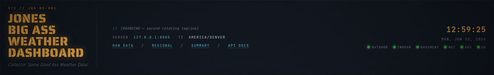

From left to right:

- **Title block** — the project name. The subtitle below it (`Collectin' Some Good Ass Weather Data!`) is hard-coded; the title and subtitle treatment in CSS gives the whole dashboard its instrument-panel feel.
- **Tagline strip** — `// [BRANDING — first rotating tagline]` in the screenshot. Comes from `branding.toml` (`[taglines.rotating]` if non-empty, else `[header.tagline]`). On each page load a random tagline from the rotating list is shown.
- **SERVER / TZ row** — the host:port the dashboard's served from, and the IANA timezone the server has resolved (derived from the outdoor sensor's GPS, or your `fallback_lat`/`fallback_lon` if GPS hasn't fixed yet).
- **API quick-links** — `Raw Data` / `Regional` / `Summary` / `API Docs` open the underlying JSON endpoints (`/api/v1/current`, `/api/v1/external`, `/api/v1/summary/outdoor`) and the interactive `/docs` explorer in a new tab. Handy for poking at the raw numbers behind any panel.
- **Clock + date** — the server's local time, rendered in the resolved zone. The seconds tick smoothly between the 30-second `/api/v1/current` polls — a local interval extrapolates from the last anchor.
- **Status row** — six LEDs, one per subsystem: OUTDOOR / INDOOR / BASEMENT / NET / GPS / DB. Green means online, amber means online but stale, red means offline or unreachable, dim means not present. **NET** tracks the optional internet feed (see *Regional Conditions* below): it's dark when the feed is disabled, green when fresh, amber when the last fetch has gone stale.

---

## Outdoor Conditions

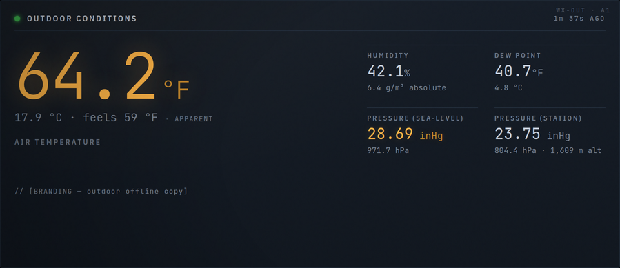

The hero panel. Air temperature in big amber readout because that's the question 90% of people open the dashboard to answer.

- **Temperature** — big number is °F; subtitle gives °C and the `feels-like` value. Feels-like uses the NWS heat-index formula (Rothfusz regression) on the warm side — above ~80°F with non-trivial humidity, expect it to read higher than the air temperature. Below the heat-index threshold it collapses to air temp. Wind chill on the cold side is **not** part of this local `feels-like` (no anemometer on the outdoor sensor) — but if you enable the optional internet feed (see the `[external]` config), a full-range apparent temperature, wind chill, and THSW index appear in the **Regional** panel and the dashboard's headline feels-like switches to the wind-aware value automatically.
- **Humidity** — relative humidity %. The smaller `g/m³ absolute` is absolute humidity (grams of water vapour per cubic metre of air), useful when you care about whether your house is gaining or losing moisture in absolute terms rather than relative to current temperature.
- **Dew Point** — temperature at which the current air would have to cool for moisture to condense. Lower than air temperature means the air is unsaturated; closer they get, the more humid it feels. Practical cutoffs:
  - dew point < 55°F: dry, comfortable
  - 55–65°F: getting humid
  - 65–70°F: oppressive
  - > 70°F: tropical
- **Pressure (Sea-Level)** — the value you compare against forecasts and other stations. `inHg` (inches of mercury) is the unit US weather reports use; `hPa` (hectopascals, = millibars) is the SI unit the rest of the world uses. Both are the *station* pressure adjusted to what it would be at sea level, using the sensor's altitude.
- **Pressure (Station)** — what the BME280 actually measured at its installed altitude. Lower at altitude (~847 hPa in Denver) than at sea level (~1013 hPa). This number is mostly informational — most weather use cases want the sea-level adjusted value.

Below the metrics: the outdoor-offline branding slot from `branding.toml`. Currently visible always, just sitting there with project copy.

---

## Sky & Astronomy

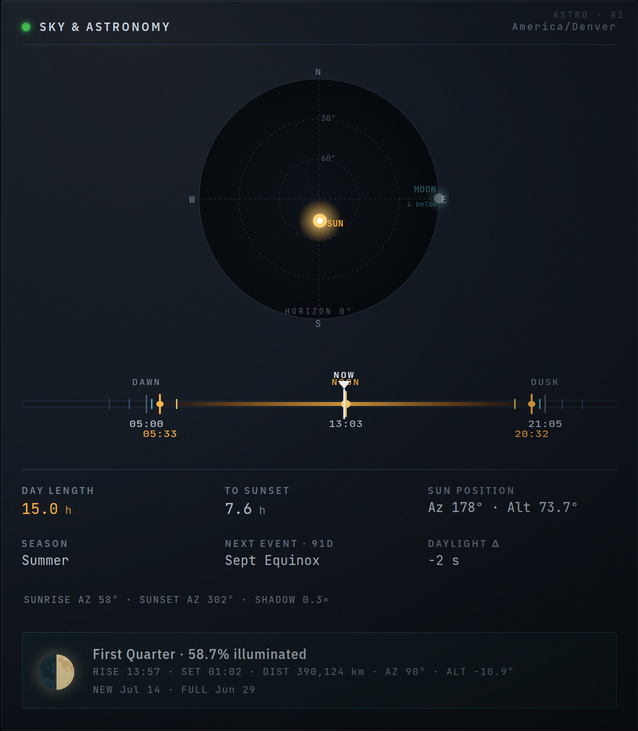

Two visualisations stacked plus a metrics strip and a moon row.

### Polar sky plot

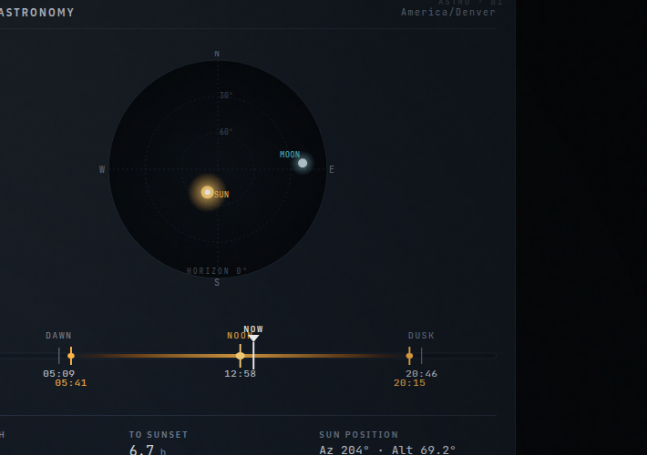

A bird's-eye view of the sky dome.

- **Circle** = the horizon. North is at the top of the circle, east is on the right, south at the bottom, west on the left. (Conventional astronomy plotting.)
- **Centre** = directly overhead. The faint rings are altitude grid lines at 30°, 60°.
- **Yellow dot** = sun position right now. Distance from the centre is `(90° − altitude) / 90°` of the radius — so a sun directly overhead is at the centre, a sun on the horizon is at the rim.
- **Cyan dot** = moon position right now. Same projection.
- Both dots fade and clamp to the horizon ring if the object is below the horizon.

It's purely a "where is the sun right now" indicator. Not used for anything beyond looking cool.

### Day arc

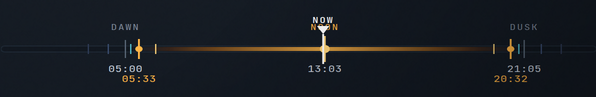

A horizontal time strip showing today's solar events.

- **Yellow gradient bar** = the part of the day between sunrise and sunset (the actual "daytime").
- **Tick marks**, left-to-right: DAWN, sunrise, solar noon, sunset, DUSK. Each labelled with its local time.
- **Twilight bands** — fainter ticks flanking sunrise and sunset mark the civil, nautical, and astronomical twilight boundaries plus the golden-hour and blue-hour windows photographers care about.
- **White triangle** = NOW. Its position is the current time projected onto the same 0:00 → 24:00 strip.

Below the arc is a metrics strip:

- **Day Length** — hours of daylight today.
- **To Sunset** (flips to **To Sunrise** after dark) — countdown to the next horizon crossing.
- **Sun Position** — the sun's current azimuth and altitude, in degrees.
- **Season** — the current astronomical season.
- **Next Event** — the next solstice or equinox, and how far off it is.
- **Daylight Δ** — how much the day has lengthened or shortened versus yesterday (in seconds) — the thing you actually notice around the solstices.

A one-liner under that reports **SUNRISE AZ / SUNSET AZ** (the compass bearings where the sun crests and drops today) and **SHADOW** (the shadow-length multiplier for the current sun altitude — how many times an object's own height its shadow stretches right now).

The moon row at the bottom of the panel is a single line — phase emoji + name + illumination percentage, then RISE / SET / DIST / AZ / ALT for the moon. Lunar distance varies between ~360,000 and ~400,000 km over a month, so that number actually moves. A second line gives the dates of the **next new and full moons**.

---

## Regional Conditions

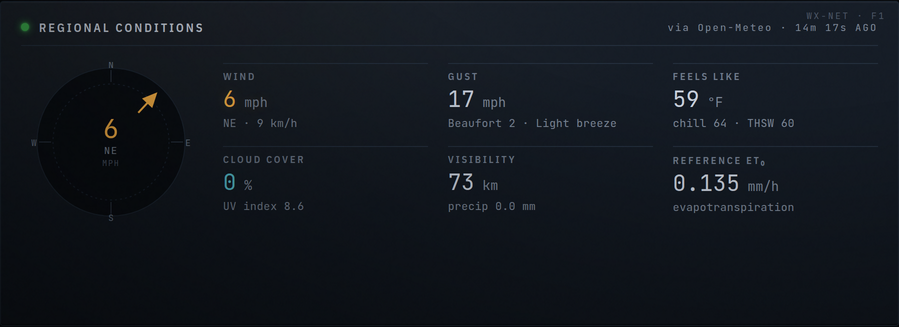

This panel is **optional** and **off by default**. The outdoor sensor has no anemometer, so wind — and everything that depends on it — comes from an internet weather feed, *if* you opt in by enabling the `[external]` block in `weather.toml` (see [`02-install-and-configure.md`](02-install-and-configure.md)). The station is offline-first: with the feed disabled, or no internet, every other panel works exactly the same and this one simply shows **NO FEED**.

- **Wind compass** — a needle pointing the direction the wind is blowing *from* (meteorological convention), with the speed in mph at the centre.
- **Wind / Gust** — sustained speed and gust speed (mph, with km/h alongside), plus the **Beaufort** force and its description ("Gentle breeze", "Near gale", …).
- **Feels Like** — the wind-aware **apparent temperature**. The subtitle adds **wind chill** (the cold-side index, only meaningful at low temperature with wind) and **THSW** (Temperature–Humidity–Sun–Wind — a hot-side comfort index that folds in solar load; it's an estimate). When this feed is live, the headline feels-like value up in the **Outdoor Conditions** panel switches from the local heat-index to this wind-aware number automatically.
- **Cloud Cover / UV** — regional cloud percentage and UV index from the provider.
- **Visibility / Precip** — horizontal visibility (km) and recent precipitation (mm).
- **Reference ET₀** — hourly reference evapotranspiration (mm/h) by the FAO-56 Penman-Monteith method, a standard irrigation-planning figure that needs wind to compute (which is why it lives here and not in the local panels).

The panel header shows where the data came from — the provider (`open-meteo`, `nws`, or `wunderground`) and, for station-based providers, the station ID and its distance from you. Two extra states can appear: a **LOW CONFIDENCE** tag (when `cross_check` is on and the model and a nearby station disagree about wind) and a stale indicator on the **NET** LED when the last successful fetch has aged out.

---

## Indoor & Basement

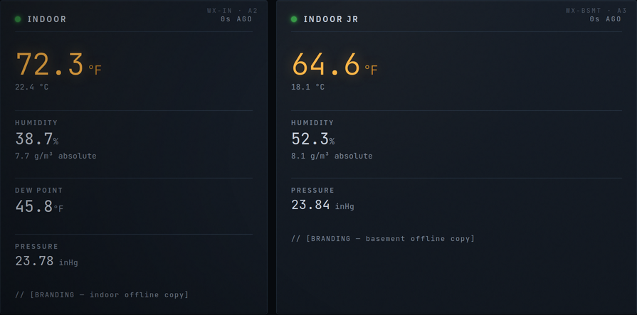

These two smaller panels share a shape: big °F number on the left, smaller °C below, then stacked metrics. The **Indoor** panel shows humidity, dew point, and pressure; **Indoor Jr** — the basement unit, same hardware as the indoor sensor, just a different room — shows humidity and pressure. The humidity tile shows relative humidity % with an absolute humidity (g/m³) subtitle, same as the outdoor panel — useful for comparing moisture content between rooms when their temperatures differ. Pressure here is *station* pressure — these sensors live indoors, so the sea-level adjustment isn't meaningful. (Useful for spotting weather fronts coming through even from inside the house.)

If a sensor goes offline, the panel changes:

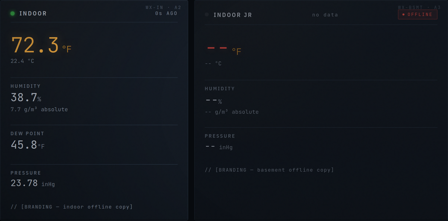

The Indoor Jr (basement) panel in the screenshot above is offline. You'll see:

- A red **OFFLINE** tag in the panel header.
- Status LED for that sensor turns red on the page header's LED row.
- Existing metrics show `--` (or the last-known values, depending on whether the server ever saw the sensor before — if it never did, you'll get all `--`; if it saw the sensor once and has since lost contact, you'll see the last known reading with "Last Known Humidity / Pressure" labels and a "last seen Nm ago" subtitle).
- The branding offline-copy slot remains visible.

This is by design — a "no data" panel is more confusing than a "here's what we last saw, X minutes ago" panel.

---

## Derived Thermodynamics

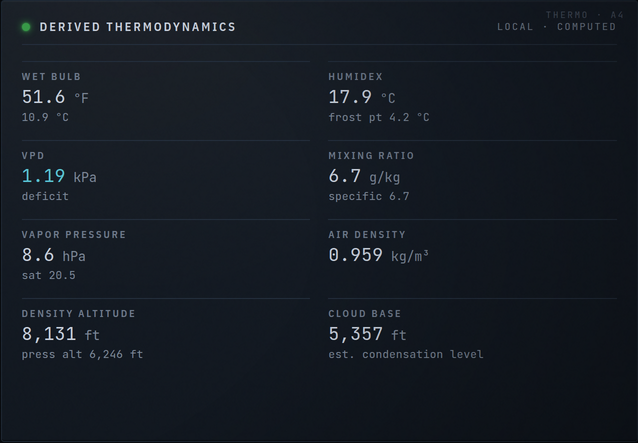

Everything in this panel is **computed by the server from the outdoor sensor's temperature, humidity, and pressure** — no extra hardware involved. It's the stuff you'd otherwise reach for a psychrometric chart to get. All of it is also available per-sensor in the API under `sensors.<id>.derived`.

- **Wet Bulb** — the temperature a thermometer wrapped in a wet wick would read; how cool you can get by evaporation. The hot-weather number that actually matters for heat stress.
- **Humidex** — the Canadian "feels like" combining heat and humidity; the subtitle gives the **frost point** (like dew point, but the temperature at which frost rather than dew would form).
- **VPD** (vapour-pressure deficit) — how much more water the air *could* hold, in kPa. The single most useful number for greenhouses and humidors: low VPD = muggy/condensing, high VPD = drying.
- **Mixing Ratio / Specific Humidity** — grams of water vapour per kilogram of dry air (mixing ratio) and per kilogram of total air (specific humidity). Unlike RH, these don't change when the air merely warms or cools.
- **Vapor Pressure** — the partial pressure of water vapour now (hPa), with the saturation value (the most it could be at this temperature) in the subtitle.
- **Air Density** — density of the moist air (kg/m³). Drops with heat, humidity, and altitude.
- **Density Altitude** — the altitude the current air density corresponds to in a standard atmosphere, with **pressure altitude** alongside. Aviation numbers: a hot day at altitude can make the air "feel" thousands of feet higher to a wing or prop.
- **Cloud Base** — the estimated height of the lifting condensation level (where rising surface air would start to form cloud), from the temperature/dew-point spread.

---

## Light Sensor + Location & GPS

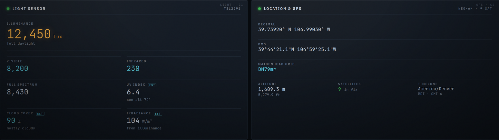

The light panel on the left is outdoor-only. The big number is illuminance in lux. The line below it ("full daylight" / "overcast daylight" / etc.) is a humanised classification:

| lux range | Label |
|---|---|
| < 1 | starlight |
| 1–10 | moonlight |
| 10–50 | twilight |
| 50–1,000 | overcast indoor |
| 1,000–10,000 | overcast daylight |
| 10,000–50,000 | full daylight |
| > 50,000 | direct sun |

Below the lux value: VISIBLE, INFRARED, FULL SPECTRUM raw counts from the TSL2591's three channels. Mostly diagnostic; the lux value is the one you actually care about.

The right-hand tiles — **UV Index**, **Cloud Cover**, **Irradiance** — each carry an **EST** chip because they are *estimates*, not measurements. The server infers them by comparing the measured lux against the clear-sky brightness expected for the sun's current altitude: a sky much dimmer than clear-sky implies cloud, and the solar geometry plus that cloud factor yields a UV-index and an irradiance (W/m²) estimate. The sub-labels show the **sun altitude** the estimate assumed and a humanised **sky condition** ("clear", "partly cloudy", "overcast", …). Cloud and UV blank out when the sun is too low for the inference to mean anything (near and after sunset). Treat these as "good enough to glance at", not instrument-grade — a real pyranometer they are not.

The location panel on the right is also outdoor-only:

- **DECIMAL** — lat/lon in decimal degrees, the format Google Maps uses.
- **DMS** — the classic Degrees-Minutes-Seconds format ("39°44'21.1\"N  104°59'25.1\"W"), the one engraved on old physical maps and used by aeronautical charts.
- **MAIDENHEAD GRID** — ham radio's compact location encoding. 4-character grids are roughly 1° × 2° (about 100 × 200 km), useful in radio contests. Denver = `DM79`.
- **ALTITUDE** — metres above sea level. Reported by the GPS module.
- **SATELLITES** — number of GPS satellites the module currently has in fix. 4+ is good, 6+ is great.
- **TIMEZONE** — the IANA zone the server resolved from your coords. Drives every wall-clock time on the dashboard.

If GPS has no fix yet (`SATELLITES = 0`), most of these fall back to "—" and the timezone falls back to whatever the server's `fallback_lat`/`fallback_lon` resolves to.

---

## Today & Trends

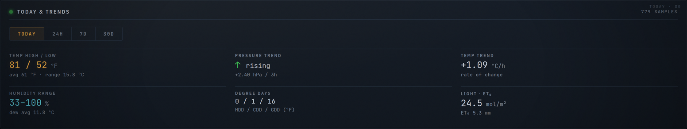

Where the charts show the *shape* of the recent past, this panel reduces it to **numbers that summarise a window** — highs, lows, trends, and a few agronomy/comfort aggregates. It's outdoor-only and comes straight from `GET /api/v1/summary/outdoor`.

The button bar at the top picks the window: **TODAY** (since local midnight), **24H**, **7D**, or **30D**. The header sub-label reads **`N SAMPLES`** — the count of raw logged readings in that window. (Note this says *samples*, not the *buckets* the Historical panel reports: here it's always the raw row count, so a 30-day window shows a much bigger number than today.)

- **Temp High / Low** — the window's hottest and coldest readings (°F), with the average and the **diurnal range** (max − min, °C) below.
- **Pressure Trend** — an arrow (↑ rising / ↓ falling / → steady) plus the actual 3-hour change in hPa. "Steady" is anything within ±0.5 hPa over three hours. Falling pressure is the classic "weather's coming" signal.
- **Temp Trend** — the rate the temperature is currently moving, in °C per hour, as a least-squares slope over the window. Positive is warming.
- **Humidity Range** — the low–high relative-humidity span, with the average dew point below.
- **Degree Days** — three running totals in °F-days: **HDD** (heating, base 65°F), **CDD** (cooling, base 65°F), and **GDD** (growing, base 50°F). Heating/cooling degree days estimate how much you ran the furnace or AC; growing degree days track accumulated warmth for gardening. The base is the temperature below (HDD/GDD) or above (CDD) which the day "counts."
- **Light · ET₀** — the **Daily Light Integral** (mol/m², the total photosynthetic light delivered — a greenhouse number) and **ET₀**, reference evapotranspiration in mm by the Hargreaves method. Hargreaves is *temperature-only* (it doesn't need wind), so it's an approximation — distinct from the wind-driven Penman-Monteith ET₀ in the Regional panel, and deliberately so, since the logged history has no wind.

---

## Historical Readings

This is the time-window panel. Six charts: temperature, humidity, pressure (sea-level), dew point, visible light, infrared.

### 1-hour window

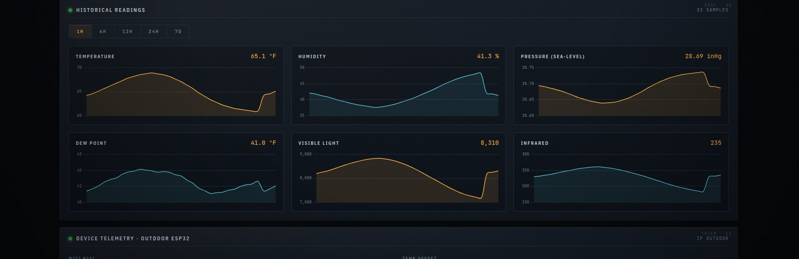

`1H` selected. Raw bucketing — the server returns every reading in the window, no averaging. Maximum noise visible; useful for catching fast transients (a door opened, a cloud passed).

### 24-hour window

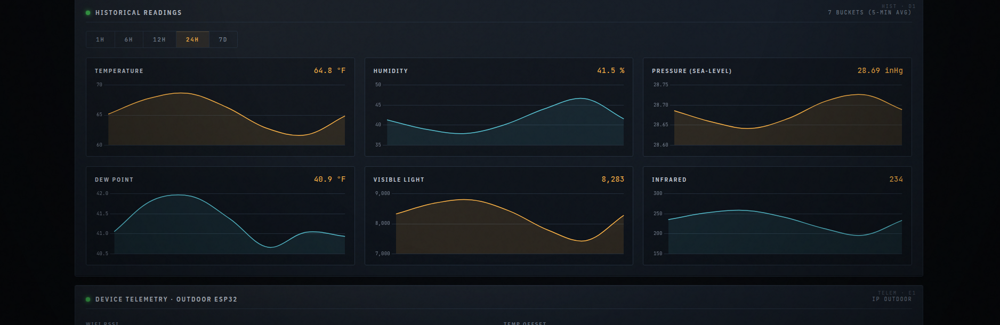

`24H` selected. The server auto-buckets to 5-minute averages — visually smoother, the day-night curve becomes obvious. This is the default and the one you'll spend the most time looking at.

### 7-day window

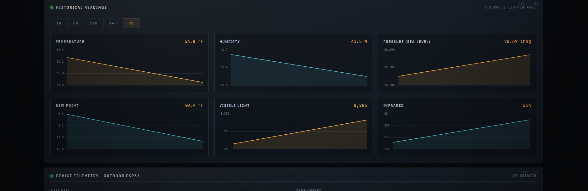

`7D` selected. Server auto-buckets to 30-minute averages. The day/night cycle compresses into a wave, weekly pressure trends become visible, you can spot incoming fronts.

A subtle point worth flagging: the panel header reads `N BUCKETS (k-MIN AVG)` when aggregated, not `N SAMPLES`. So a 7-day window with 30-minute buckets is `336 BUCKETS (30-MIN AVG)`, not `336 SAMPLES`. This is why a 7D view can show fewer "samples" in the header than a 1H view despite covering 168× the time — each "sample" in 7D represents 30 minutes of averaged data.

The auto-bucket heuristic (`docs/design/02-api-design.md:290`):

| Window | Bucket |
|---|---|
| ≤ 1 h | raw |
| ≤ 6 h | 1 minute |
| ≤ 24 h | 5 minutes |
| ≤ 7 d | 30 minutes |
| > 7 d | 1 hour |

You can also deep-link to a specific window with `?hours=N` in the URL, e.g. `http://<host>:8005/dashboard/?hours=168` for the 7-day view.

---

## Device Telemetry

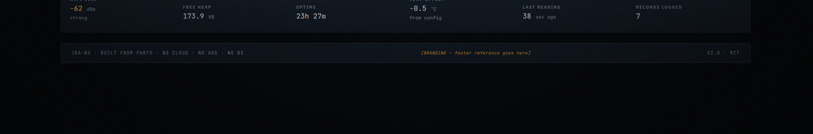

Diagnostic information for when something's weird.

- **WIFI** — RSSI in dBm. > -50 excellent; -50 to -65 strong; -65 to -75 fair; < -75 weak (expect dropouts).
- **FREE HEAP** — RAM remaining on the outdoor ESP32. Stable around 150–180 KB indicates a healthy sketch; a slow downward drift over days indicates a memory leak (none known in the current sketches, but worth watching after firmware changes).
- **UPTIME** — how long since the ESP32 last booted. A small number that resets often means brownouts or watchdog reboots; investigate the WiFi log and the power supply.
- **CALIBRATION** — the `temp_offset_c` you set in `weather.toml`, in °C. Diagnostic only — useful when comparing the dashboard's reading against an external thermometer.
- **LAST READING** — seconds since the server last wrote an outdoor row to SQLite. Should stay close to the logger interval (default 60 s).
- **RECORDS LOGGED** — total rows in the outdoor history within the currently selected chart window (NOT the lifetime row count). Goes up over the lifetime of the install, scaled by the window.

---

## The tray widget

If you ran `install.sh --with-widget` and configured `widget/config.toml`, the system-tray widget is a thin readout for the same data:

- **Tray icon** — a thermometer emoji followed by the current outdoor temperature in °F / °C.
- **Left-click** — popup with the full readout: temperature, dew point, humidity, pressure, altitude, sunrise/sunset/solar-noon, day length, time to sunset, sun and moon positions, moon phase + illumination, moonrise/moonset, lux, WiFi RSSI, GPS in decimal + DMS, Maidenhead grid, satellites, timezone, device uptime, last-updated timestamp.
- **Right-click** — system menu: "Open dashboard" (launches your default browser pointed at `server_url`) and "Quit".

The widget polls `/api/v1/current` every 30 seconds. It does no math of its own — every number is read straight from the API.

---

## Understanding the derived values

A couple of "wait, which one is real?" gotchas worth knowing about.

### Station vs sea-level pressure

The barometer measures the *actual* air pressure at the sensor's altitude. At any altitude above sea level that's lower than what you hear on the news.

```
Denver (1609 m / 5280 ft altitude):
  Station pressure:    ~847 hPa / 25.0 inHg
  Sea-level pressure: ~1023 hPa / 30.2 inHg   ← matches NWS
```

The dashboard shows both. **The sea-level value is the one you compare against forecasts and other stations**, because the rest of the world is reporting sea-level pressure regardless of their altitude. Station pressure is what the sensor measured; sea-level pressure is what the BME280's reading would be if it were teleported to sea level.

If your local NWS station reports a value wildly different from what the dashboard shows, double-check `fallback_altitude_m` in `weather.toml`. Each 8 m of altitude error contributes about 1 hPa of pressure error in the conversion.

### Dew point vs humidity

Relative humidity changes with temperature — air at 70°F and 60% RH has the same amount of water in it as air at 75°F and 51% RH. **Dew point** is a temperature, and unlike RH it doesn't move when the air warms or cools. It's a better single number for "how muggy does it feel" or "is condensation likely on cold surfaces tonight."

Practical: when the dew point gets within 5°F of the air temperature, expect fog. When it crosses above 65°F, it feels muggy. When it crosses above 70°F, it's tropical-feeling.

### Absolute humidity

Same data, different units. Relative humidity is a percentage; absolute humidity is grams of water per cubic metre of air. Useful when you care about whether the air is actually drying out (e.g., for a humidor or a piano) rather than how saturated it is relative to its current temperature.

### Lux scale

The TSL2591 has a huge dynamic range, which it needs because the human eye sees from `1 lux` (moonlight) to `100,000 lux` (direct noon sun) — five orders of magnitude. The lux readout is logarithmic in practice:

| Lux | Means |
|---|---|
| 0.001 | Overcast night |
| 0.1 | Moonless clear night |
| 1 | Full moonlight |
| 100 | Living room at night |
| 1,000 | Office light |
| 10,000 | Overcast daylight |
| 50,000 | Full daylight, no direct sun |
| 100,000 | Direct sun at noon |

---

## The API

Everything you see on the dashboard, plus more, is available as JSON from the server's HTTP API.

| Endpoint | What it gives you |
|---|---|
| `GET /api/v1/current` | Latest reading from every sensor + the full astronomy block + the optional `external` block (null when the internet feed is off) |
| `GET /api/v1/current/{sensor_id}` | One sensor's latest reading + astronomy + `external` |
| `GET /api/v1/history/outdoor` | Time-bucketed outdoor history (the chart data). Window via `?hours=` or explicit `?from=&to=` (ISO 8601) |
| `GET /api/v1/summary/outdoor` | Windowed history summary: hi/lo/avg, pressure tendency, degree days, DLI, ET₀ (`?period=today\|24h\|7d\|30d`) |
| `GET /api/v1/external` | The internet-sourced regional block alone: wind, cloud, UV, precip, visibility + fused comfort indices (null when offline) |
| `GET /api/v1/sensors` | Sensors registered with the server + their status |
| `GET /api/v1/astronomy` | Just the astronomy block (sun + moon at the reference location) |
| `GET /api/v1/branding` | The parsed `branding.toml` (used by the dashboard itself) |
| `GET /api/v1/health` | Server / DB / loggers / sensors aggregate health |
| `GET /docs` | Interactive OpenAPI explorer — every endpoint, every parameter, try-it-out |

> **More than meets the eye.** Most of these numbers also live in the API under
> `sensors.<id>.derived`: the thermodynamics stack (wet-bulb, VPD, mixing/specific humidity,
> humidex, frost point, air density, density/pressure altitude, cloud base) that the **Derived
> Thermodynamics** panel shows, plus a `derived.sky` sub-block (estimated irradiance, cloud cover,
> UV index, sky condition) that the **Light Sensor** panel surfaces. The windowed aggregates behind
> **Today & Trends** come from `/api/v1/summary/outdoor` instead. The full field list is in the
> OpenAPI explorer (`/docs`) and [`docs/design/02-api-design.md`](design/02-api-design.md).

A few useful one-liners:

```bash
# Live outdoor temperature in °F:
curl -s http://localhost:8005/api/v1/current | jq '.sensors.outdoor.derived.temperature_f'

# Maidenhead grid:
curl -s http://localhost:8005/api/v1/current | jq '.sensors.outdoor.location.maidenhead'

# Pressure history, 6-hour window, 1-minute buckets, only pressure:
curl -s 'http://localhost:8005/api/v1/history/outdoor?hours=6' | jq '.rows | map(.pressure_sealevel_hpa)'

# When does the moon set tomorrow?
curl -s http://localhost:8005/api/v1/astronomy | jq '.astronomy.moon.moonset'
```

---

## Building your own consumer

Three tiny example consumers to spark ideas.

### Shell: every-minute log of pressure trend

```bash
#!/usr/bin/env bash
while true; do
    p=$(curl -s http://localhost:8005/api/v1/current \
        | jq -r '.sensors.outdoor.derived.pressure_sealevel_inhg')
    echo "$(date -Iseconds)  ${p} inHg"
    sleep 60
done >> /tmp/pressure.log
```

### Python: log lux excursions to a CSV

```python
#!/usr/bin/env python3
"""Append a row to lux.csv whenever the outdoor lux crosses a threshold."""
import csv, datetime, time, urllib.request, json

URL = "http://localhost:8005/api/v1/current"
PATH = "/tmp/lux.csv"
THRESHOLD = 1000   # lux

last_above = None
while True:
    data = json.loads(urllib.request.urlopen(URL, timeout=5).read())
    lux = data["sensors"]["outdoor"]["raw"]["lux"]
    if lux is None:
        time.sleep(60); continue
    now_above = lux > THRESHOLD
    if last_above is not None and now_above != last_above:
        with open(PATH, "a", newline="") as f:
            csv.writer(f).writerow([
                datetime.datetime.now().isoformat(),
                f"{lux:.1f}",
                "above" if now_above else "below",
            ])
    last_above = now_above
    time.sleep(60)
```

### JavaScript: a tiny moon-phase widget

```html
<!doctype html>
<html><body>
<div id="moon" style="font-size:48px"></div>
<script>
async function tick() {
  const r = await fetch('http://192.168.1.62:8005/api/v1/astronomy');
  const m = (await r.json()).astronomy.moon;
  document.getElementById('moon').textContent =
    `${m.phase_icon} ${m.phase_name} ${m.illumination_pct.toFixed(0)}%`;
}
tick(); setInterval(tick, 60 * 60 * 1000);   // once an hour
</script>
</body></html>
```

Drop into any browser pointed at your collector. CORS isn't enabled by default, so this only works if it's served from the same origin — but the server's `dashboard/` directory is a fine place to drop side projects.

---

## Done

That's the whole dashboard. If anything in here is wrong or unclear, the source of truth for "why was this designed this way" is [`docs/design/01-findings.md`](design/01-findings.md) — the decisions log from the rebuild.
